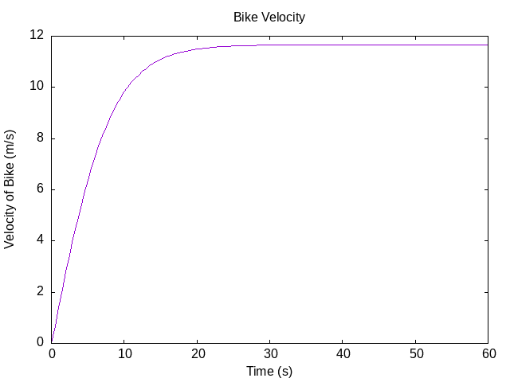

# Chaper 14: Newton's Second Law and Differential Equations

## Car Velocity (Constant Force)

From [src/ch14/car_graph.hs](../src/ch14/car_graph.hs)


## Child Pedaling (Force as a function of time)

From [src/ch14/pedal_coast.hs](../src/ch14/pedal_coast.hs)

The Force as a function of time as defined in the book was confusing to me. I
rewrote it to use modulo (since that's pretty common in programming).

From the Book:

``` haskell
pedalCoast t 
    = let tCycle = 20
          nComplete :: Int
          nComplete = truncate (t / tCycle)
          remainder = t - fromIntegral nComplete * tCycle
      in if remainder < 10
         then 10 
         else 0
```

Writing it out helps my confusion a bit - instead of using a modulo to keep `t`
between 0 and 20, the function from the book scales the `tCycle` up based on the
number of cycles that have been completed.

`truncate` is a cool function, which lops the decimal off a `Double` value.


## Bike Velocity (with Air Resistance)

From [src/ch14/bike_velocity](../src/ch14/bike_velocity.hs)

I used a different definition for `velocityFv` than what's in the book because
the book definition uses `!!` and I didn't know what that did exactly ... 

``` haskell
velocityFv dt m v0 fx t
  = let numSteps = abs $ round (t / dt)
    in iterate (updateVelocity dt m fx) v0 !! numSteps
```

I think this is a list indexer function? I prefered a version using `last` and
`take`, but this requires a base case when `numSteps` is 0:

``` haskell
velocityFv dt m v0 fx t
  = let numSteps = abs $ round (t / dt)
    in if (numSteps == 0)
       then v0
       else last $ take numSteps $ iterate (updateVelocity dt m fx) v0
```

I think this is a bit more clear. It also makes sure that the velocity at 0 is
`v0` (which it should be by definition).


