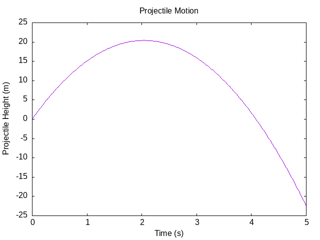

## Graphing with GNU Plot and Haskell

Page 91 and 165 are a good start for reading. Learn Physics with Functional
Programming uses `gnuplot` to do plotting. This requires `gnuplot` to be
installed in Ubuntu:

> sudo apt install gnuplot

and the `gnuplot` package to included in the cabal executable:

``` cabal
common essential
    ghc-options:      -Wall
    build-depends:    base ^>=4.17.2.1,
                      gnuplot ^>=0.5.7
    default-language: GHC2021

executable graphing-simple-xy
    import:           essential
    hs-source-dirs:   src/graphing
    main-is:          simple_xy.hs
```

### Simple X Y Graphing

See [src/graphing/simple_xy.hs](src/graphing/simple_xy.hs)

This plot creates a simple projectile motion image. Great to make sure the
`gnuplot` is installed correctly.


